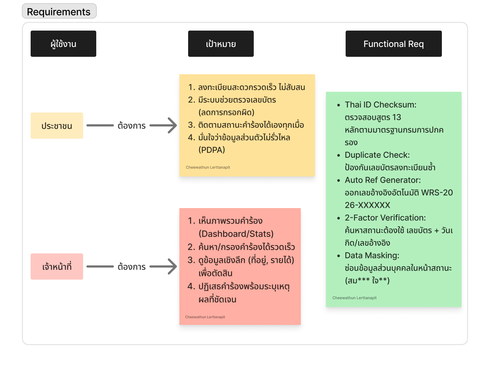
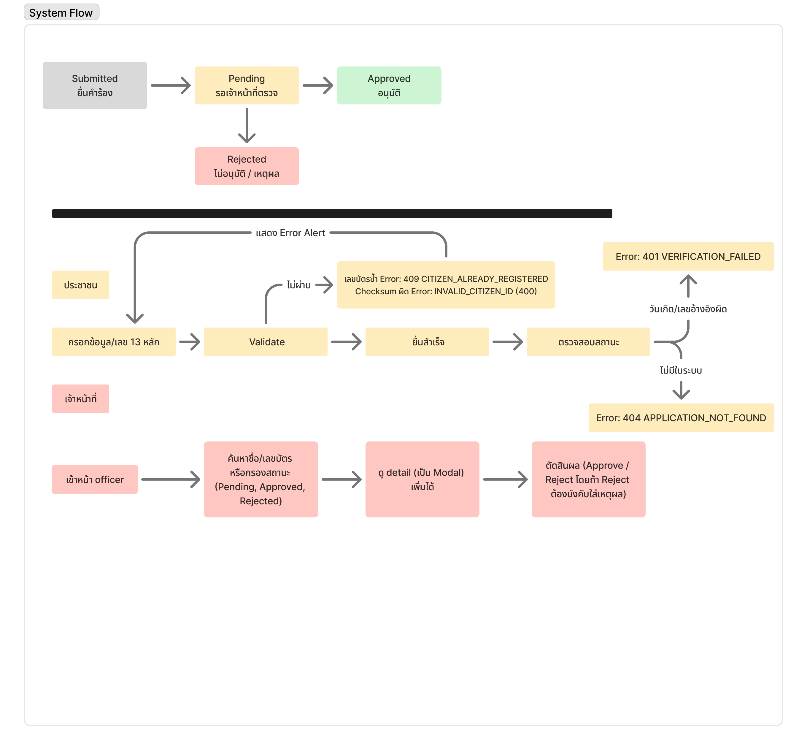
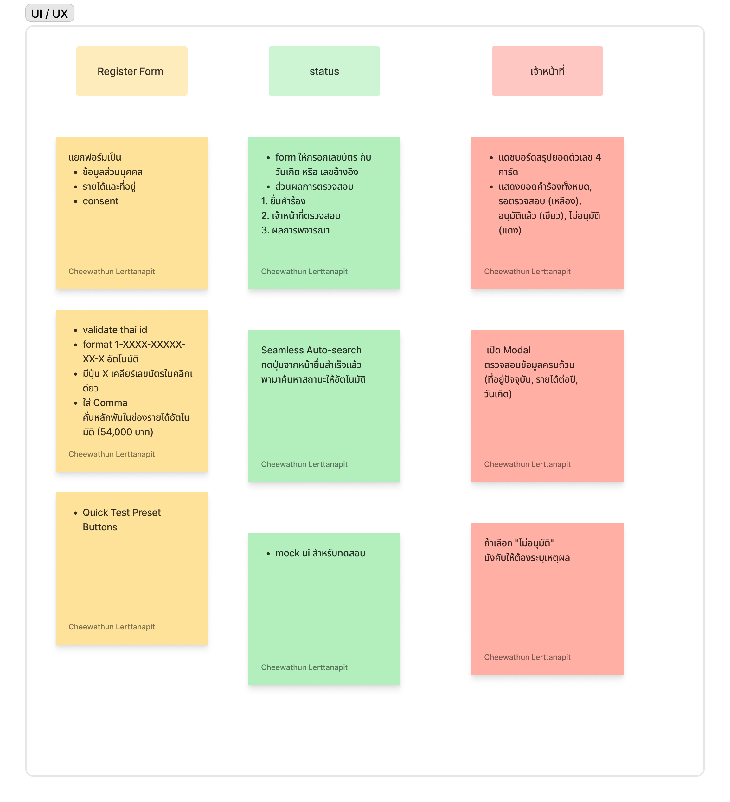
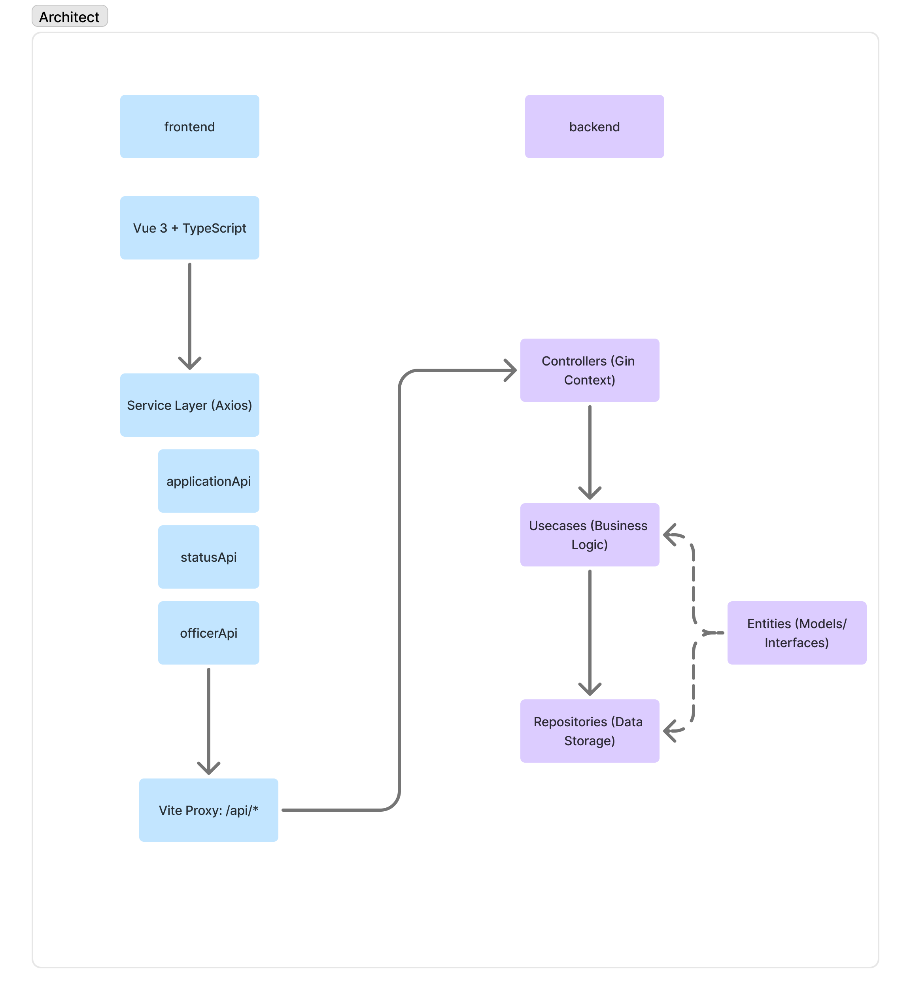
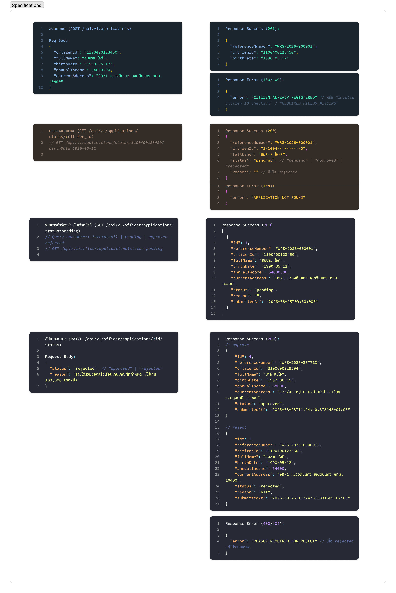
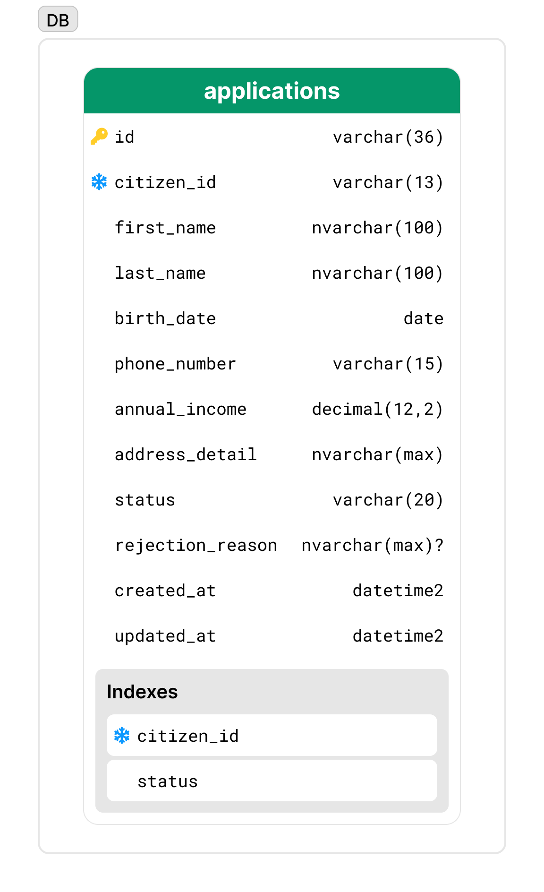
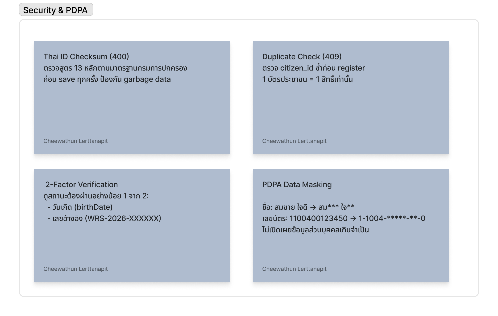

# ระบบลงทะเบียนบัตรสวัสดิการแห่งรัฐ

ระบบลงทะเบียน ตรวจสอบสถานะ และพิจารณาคำร้องสวัสดิการแห่งรัฐ  
พัฒนาด้วย **Vue 3 + TypeScript** (Frontend) และ **Go + Gin Framework** (Backend)

---

## Tech Stack

| Layer        | Technology                                            |
| :----------- | :---------------------------------------------------- |
| Frontend     | Vue 3, TypeScript, Composition API, Axios, Vue Router |
| Backend      | Go, Gin Framework                                     |
| Database     | SQLite (ผ่าน GORM)                                    |
| Architecture | Entities → Repositories → Usecases → Controllers      |

---

## โครงสร้างโปรเจกต์

```
welfare-registration-system/
├── backend/
│   ├── internal/
│   │   ├── entities/         # Data Model, DTOs, Repository/Usecase Interfaces
│   │   ├── repositories/     # SQLite + GORM (sqlite_repo.go)
│   │   ├── usecases/         # Business Logic (Checksum, PDPA Masking, Ref Number)
│   │   └── controllers/      # Gin HTTP Routing
│   ├── main.go               # Entrypoint + Dependency Injection
│   ├── go.mod
│   └── go.sum
└── frontend/
    └── src/
        ├── views/
        │   ├── Register.vue  # หน้าลงทะเบียน
        │   ├── Status.vue    # หน้าตรวจสอบสถานะ
        │   └── Officer.vue   # หน้าเจ้าหน้าที่พิจารณาคำร้อง
        └── services/         # API Clients (applicationApi, statusApi, officerApi)
```

---

## วิธีรันระบบ

### 1. รัน Backend

```bash
cd backend
go run main.go
# Server: http://localhost:8080
# welfare.db และข้อมูลตัวอย่างจะถูกสร้างอัตโนมัติ
```

### 2. รัน Frontend

```bash
cd frontend
npm install
npm run dev
# Frontend: http://localhost:5173
```

---

## API Endpoints

Base URL: `http://localhost:8080/api/v1`

| Method  | Endpoint                           | คำอธิบาย                                            |
| :------ | :--------------------------------- | :-------------------------------------------------- |
| `POST`  | `/applications`                    | ยื่นคำร้องลงทะเบียน                                 |
| `GET`   | `/applications/status/:citizenId`  | ตรวจสอบสถานะด้วยเลขบัตร ฯ + วันเกิด หรือ เลขอ้างอิง |
| `GET`   | `/officer/applications`            | รายการคำร้องทั้งหมด (รองรับ `?status=pending`)      |
| `PATCH` | `/officer/applications/:id/status` | เจ้าหน้าที่อนุมัติ / ไม่อนุมัติ พร้อมเหตุผล         |

---

## ข้อมูลทดสอบ (Seed Data)

| ชื่อ         |    เลขบัตรฯ     |  วันเกิด   | รายได้/ปี |     สถานะ      |
| :----------- | :-------------: | :--------: | :-------: | :------------: |
| สมชาย ใจดี   | `1100400123450` | 1990-05-12 |  54,000   |  🟡 รอตรวจสอบ  |
| สมหญิง รักดี | `1101700205673` | 1988-11-20 |  72,000   | 🟢 อนุมัติแล้ว |
| วิชัย ตั้งใจ | `1102500337895` | 1985-02-14 |  142,000  | 🔴 ไม่อนุมัติ  |

> เลขบัตรประชาชนที่ใช้ทดสอบลงทะเบียนใหม่ (ยังไม่มีในระบบ): `3100600929594`

---

## Application Flow

```
Citizen ยื่นคำร้อง
       ↓
   [Pending]  ← สถานะเริ่มต้น
       ↓
เจ้าหน้าที่พิจารณา
  ↙           ↘
[Approved]  [Rejected] + เหตุผล
```

---

## 📋 Planning Board

### 1. Requirements


### 2. System Flow


### 3. UI / UX


### 4. Architecture


### 5. Specifications


### 6. DB Schema


### 7. Security & PDPA

